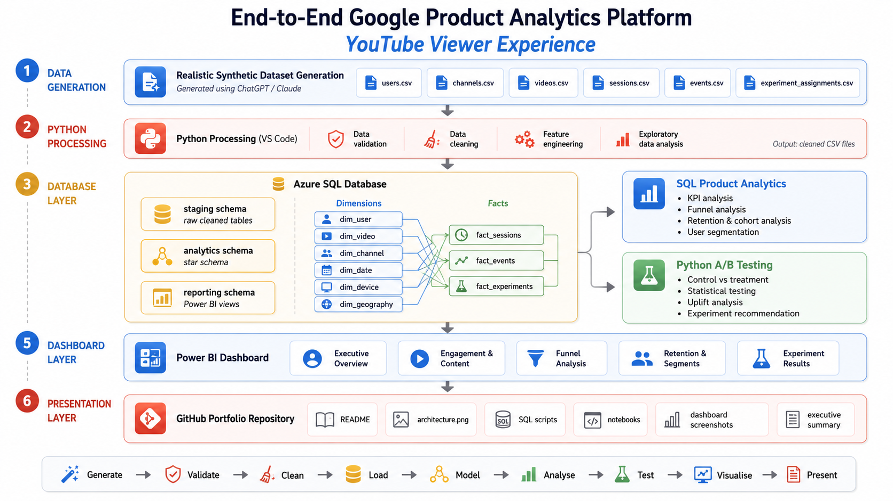
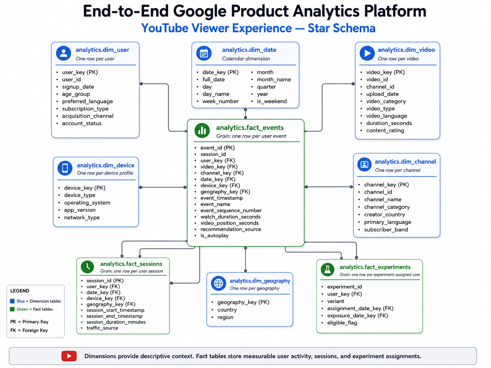
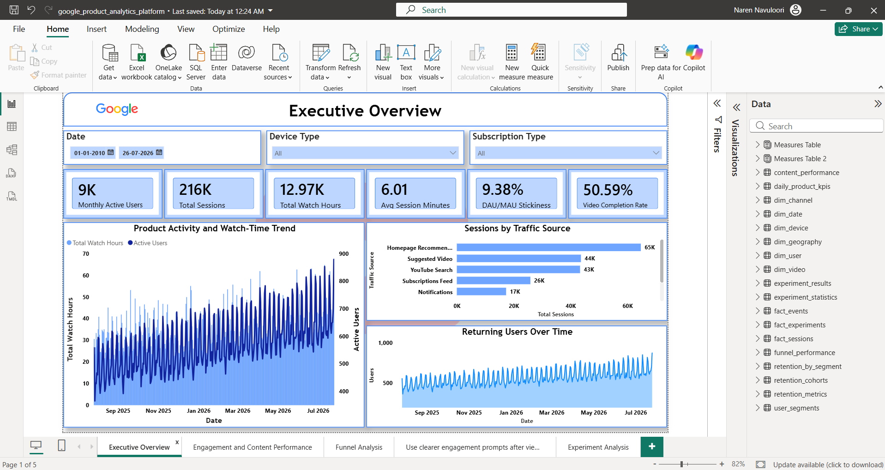
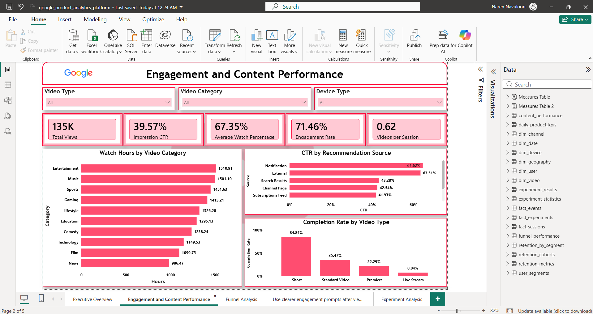
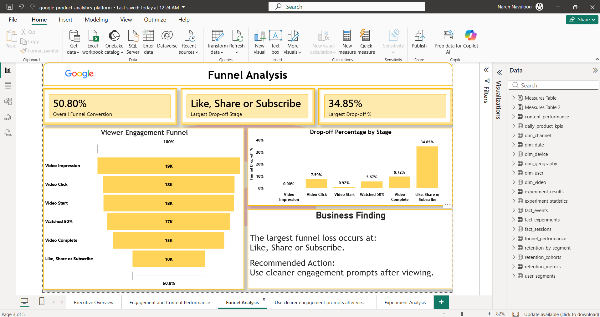
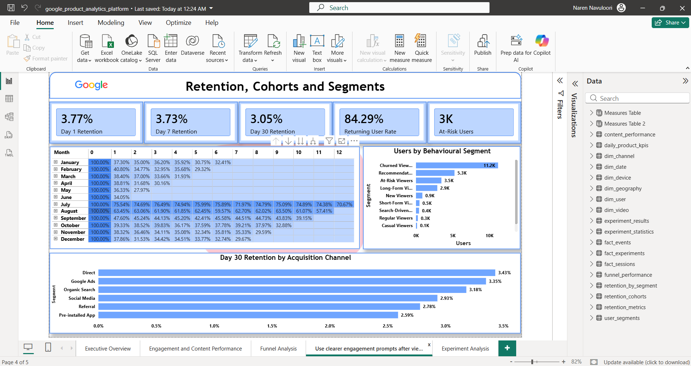
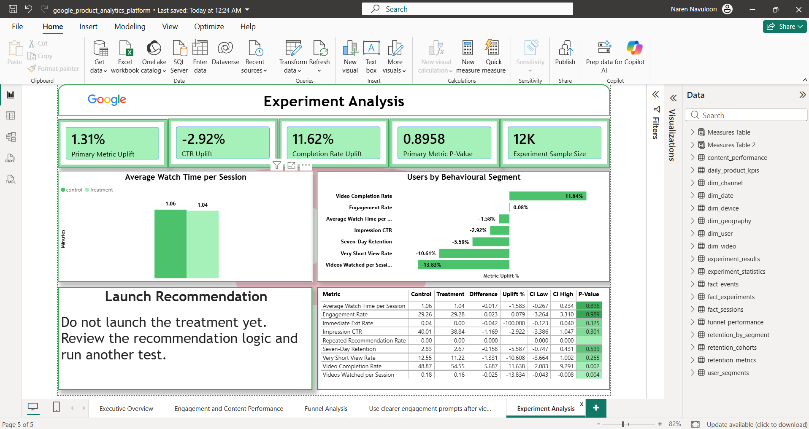

# End-to-End Google Product Analytics Platform

<p align="center">
  <strong>YouTube Viewer Experience Analytics</strong>
</p>

<p align="center">
  A complete product analytics portfolio project built with Python, Azure SQL Database, SQL Server Management Studio, Power BI, and realistic synthetic event-level data.
</p>

<p align="center">
  
  
  
  
  
</p>

---

## Project Overview

This project simulates the work of a **Product Data Analyst on the YouTube Viewer Experience team**.

The platform analyses how viewers:

- Discover videos through recommendations, search, subscriptions, notifications, and external sources
- Move from video impressions to clicks, starts, completions, and engagement
- Watch different categories and video formats
- Return to the platform over time
- Form behavioural segments
- Respond to a hypothetical new homepage recommendation-ranking algorithm

The complete workflow covers:

```text
Generate → Validate → Clean → Load → Model → Analyse → Test → Visualise → Present
```

The project uses **realistic synthetic data only** and does not contain real Google or YouTube user information.

---

## Business Problem

> How can YouTube improve content discovery, viewer engagement, watch time, and long-term retention while maintaining a useful viewer experience?

The analysis answers five central business questions:

1. How actively are users engaging with the platform?
2. Which discovery sources create valuable viewing sessions?
3. Where do viewers drop out of the video-viewing funnel?
4. Which users and cohorts demonstrate the strongest retention?
5. Did the new recommendation algorithm improve viewer behaviour?

---

## Project Architecture



### End-to-End Flow

| Layer | Work completed |
|---|---|
| Data generation | Six related synthetic CSV datasets |
| Python processing | Validation, cleaning, feature creation, and EDA |
| Azure SQL staging | Cleaned source tables |
| Azure SQL analytics | Star schema with dimensions and facts |
| SQL product analytics | KPIs, funnel, retention, cohorts, and segments |
| Python experimentation | A/B-test validation and statistical testing |
| Power BI | Five-page executive dashboard |
| GitHub presentation | Documentation, diagrams, screenshots, and findings |

---

## Dataset

The synthetic dataset represents approximately twelve months of YouTube-style viewer behaviour.

| Dataset | Cleaned rows | Grain |
|---|---:|---|
| Users | 25,000 | One row per viewer account |
| Channels | 2,000 | One row per channel |
| Videos | 10,000 | One row per video |
| Sessions | 216,464 | One row per viewer session |
| Events | 1,609,012 | One row per viewer action |
| Experiment assignments | 12,500 | One row per experiment participant |

### Main Event Types

```text
app_open
homepage_view
video_impression
video_click
video_start
video_progress_25
video_progress_50
video_progress_75
video_complete
search
like
comment
share
subscribe_channel
save_to_watch_later
session_end
```

### Experiment Split

| Variant | Users |
|---|---:|
| Control | 6,250 |
| Treatment | 6,250 |

---

## Data Quality and Cleaning

The raw files intentionally included realistic data-quality issues.

Python validation and cleaning removed:

- 25 duplicate user rows
- 649 duplicate session rows
- 3,218 duplicate event rows
- Inconsistent capitalization and extra spaces
- Incorrect text formatting across devices, countries, subscriptions, and traffic sources

The final cleaned data passed the important checks:

```text
Duplicate primary keys             0
Null primary keys                  0
Orphan session users               0
Orphan event sessions              0
Invalid video references           0
Events outside session times       0
Negative watch duration            0
Users in multiple variants         0
```

Context-dependent missing values were preserved when valid. For example, an `app_open` event does not require a `video_id`.

---

## Star Schema



### Dimension Tables

| Table | Purpose |
|---|---|
| `analytics.dim_date` | Calendar attributes |
| `analytics.dim_user` | Viewer profile and acquisition attributes |
| `analytics.dim_video` | Video category, format, language, and duration |
| `analytics.dim_channel` | Channel information |
| `analytics.dim_device` | Device, operating system, application version, and network |
| `analytics.dim_geography` | Country and region |

### Fact Tables

| Table | Grain |
|---|---|
| `analytics.fact_sessions` | One row per viewer session |
| `analytics.fact_events` | One row per viewer event |
| `analytics.fact_experiments` | One row per user assigned to an experiment |

Surrogate integer keys are used for analytical relationships while original source IDs are retained for traceability.

---

## Core Product Metrics

| Area | Metrics |
|---|---|
| User activity | DAU, WAU, MAU, DAU/MAU Stickiness, new users, returning users |
| Sessions | Total sessions, average session duration, sessions per user |
| Viewing | Total views, watch hours, videos per session, watch percentage, completion rate |
| Discovery | Impressions, clicks, impression CTR, search success rate, recommendation CTR |
| Engagement | Likes, comments, shares, subscriptions, engagement rate |
| Retention | Day 1, Day 7, Day 14, Day 30, weekly, monthly, and cohort retention |
| Experimentation | Uplift, confidence intervals, p-values, and guardrail metrics |

### Selected Metric Definitions

```text
Impression CTR =
Video Clicks ÷ Video Impressions
```

```text
Video Completion Rate =
Video Completions ÷ Video Starts
```

```text
Engagement Rate =
Users who liked, commented, shared, or subscribed
÷
Users who started a video
```

```text
DAU/MAU Stickiness =
Daily Active Users ÷ Monthly Active Users
```

---

## Analytical Work Completed

### Product KPI Analysis

Measured product health and usage across users, sessions, viewing, discovery, and engagement.

### Funnel Analysis

Analysed the following viewer journey:

```text
Video Impression
        ↓
Video Click
        ↓
Video Start
        ↓
Watched 50%
        ↓
Video Complete
        ↓
Like, Share, or Subscribe
```

For each stage, the project calculates:

- Users reaching the stage
- Conversion from the previous stage
- Overall funnel conversion
- Drop-off count
- Drop-off percentage

### Retention and Cohort Analysis

Calculated:

- Day 1, Day 7, Day 14, and Day 30 retention
- Weekly and monthly retention
- Returning-user rate
- Monthly cohort retention matrix
- Retention by acquisition channel, subscription, device, country, traffic source, and content preference

### User Segmentation

Created rule-based behavioural segments:

```text
New Viewers
Casual Viewers
Regular Viewers
Highly Engaged Viewers
Search-Driven Viewers
Recommendation-Driven Viewers
Short-Form Viewers
Long-Form Viewers
At-Risk Viewers
Churned Viewers
```

### A/B Testing

Evaluated a hypothetical new personalised homepage recommendation-ranking algorithm.

| Component | Definition |
|---|---|
| Control | Existing recommendation algorithm |
| Treatment | New personalised recommendation algorithm |
| Primary metric | Average Watch Time per Session |
| Secondary metrics | CTR, videos per session, completion, engagement, and Day 7 retention |
| Guardrails | Immediate exits, very short views, and repeated recommendations |
| Statistical methods | Welch t-test, two-proportion z-test, and 95% confidence intervals |

The experiment used:

- Seven-day pre-experiment balance checks
- A fourteen-day post-exposure measurement window
- User-level metrics
- Statistical and practical significance checks

---

# Power BI Dashboard

The final report contains five focused pages.

---

## 1. Executive Overview



### Main KPIs

- Monthly Active Users
- Total Sessions
- Total Watch Hours
- Average Session Duration
- DAU/MAU Stickiness
- Video Completion Rate

### Business Purpose

Provides leadership with an immediate view of product health, usage trends, traffic sources, and returning-user behaviour.

---

## 2. Engagement and Content Performance



### Main KPIs

- Total Views
- Impression CTR
- Average Watch Percentage
- Engagement Rate
- Videos per Session

### Business Purpose

Identifies categories, recommendation sources, and video formats that generate stronger viewing and engagement.

---

## 3. Funnel Analysis



### Main KPIs

- Overall Funnel Conversion
- Largest Drop-off Stage
- Largest Drop-off Percentage

### Business Purpose

Shows where viewers leave the journey and which product stage needs the greatest attention.

---

## 4. Retention, Cohorts, and Segments



### Main KPIs

- Day 1 Retention
- Day 7 Retention
- Day 30 Retention
- Returning User Rate
- At-Risk Users

### Business Purpose

Measures long-term product value, cohort quality, user health, and behavioural segment distribution.

---

## 5. Experiment Analysis



### Main KPIs

- Primary Metric Uplift
- CTR Uplift
- Completion Rate Uplift
- Primary Metric P-Value
- Experiment Sample Size

### Business Purpose

Communicates whether the new recommendation experience should be launched, continued, or rejected.

---

## Key Findings

### 1. Product usage was broad, but concentrated in a smaller active base

The dataset contained **25,000 viewer accounts**, of which approximately **20,459 generated activity** during the analysis period.

The platform recorded:

- **216,464 sessions**
- **1.61 million events**
- **12,974.08 watch hours**
- Approximately **6.01 minutes per session**

### 2. Homepage recommendations were the largest traffic and watch-time driver

Homepage Recommendation generated the highest number of sessions, followed by Suggested Video and YouTube Search.

This confirms that recommendation surfaces are central to the viewer journey and should remain a primary optimisation area.

### 3. Search showed stronger intent but shorter viewing sessions

Search Results produced comparatively strong click-through behaviour, indicating that viewers often know what they want.

However, search-led sessions were shorter than major recommendation-led sessions. Search quality should therefore be measured using both CTR and downstream watch time.

### 4. Mobile produced the most activity, while television produced deeper sessions

Mobile was the dominant device for user activity and session volume.

Television sessions were longer, suggesting that TV viewers engage in more deliberate, long-form viewing.

### 5. Shorts delivered strong completion but lower watch-time depth

Shorts had the highest completion rate among video formats, while standard and long-form formats generated more watch-time depth.

The two formats should therefore be evaluated using different success metrics:

- Shorts: completion, repeat viewing, and discovery
- Long-form: watch time, session depth, and retention

### 6. The largest funnel loss occurred after video completion

The funnel achieved approximately **50.80% overall conversion** from impression to engagement.

The largest stage loss was between:

```text
Video Complete
        ↓
Like, Share, or Subscribe
```

The drop-off was approximately **34.85%**.

### 7. The treatment recommendation algorithm should not be launched yet

The experiment produced mixed results:

- Average Watch Time per Session decreased by approximately **1.58%**
- Primary metric p-value was approximately **0.8958**
- Impression CTR decreased by approximately **2.92%**
- Videos Watched per Session decreased by approximately **13.83%**
- Video Completion Rate increased by approximately **11.62%**

The completion improvement was statistically meaningful, but the primary watch-time metric did not improve. The treatment should therefore be revised and tested again before launch.

---

## Product Recommendations

### Improve engagement after video completion

Use clearer, context-sensitive prompts for likes, shares, and subscriptions after viewers complete a video.

Avoid aggressive prompts that interrupt the viewing experience.

### Optimise recommendations for downstream quality

Do not judge recommendations using CTR alone.

Measure:

- Watch time after click
- Completion rate
- Videos watched per session
- Seven-day retention
- Immediate exits

### Personalise by device context

Use different recommendation strategies for:

- Mobile viewers seeking fast discovery
- TV viewers engaging in longer viewing sessions
- Desktop viewers conducting more deliberate searches

### Treat Shorts and long-form content differently

Use separate KPI targets and recommendation logic for short-form and long-form content.

### Improve re-engagement for at-risk users

Use personalised notifications and recommendations based on:

- Previous content preference
- Primary traffic source
- Last active date
- Subscription type
- Historical engagement level

### Redesign and retest the recommendation treatment

The current treatment should not be launched.

The next experiment should focus on:

- Stronger recommendation relevance
- Maintaining completion improvements
- Recovering watch time and videos per session
- Improving recommendation diversity
- Monitoring retention over a longer period

---

## Business Impact

The recommended actions may improve:

| Business area | Expected impact |
|---|---|
| Viewer engagement | More meaningful likes, shares, comments, and subscriptions |
| Watch time | Better alignment between recommendations and viewer intent |
| Content discovery | More relevant homepage, search, and suggested-video experiences |
| Retention | Stronger onboarding and personalised re-engagement |
| Recommendation effectiveness | Balanced optimisation across clicks, watch depth, and satisfaction |
| Product decision-making | Clear launch decisions supported by experimentation and guardrails |

---

## Technology Stack

| Tool | Use |
|---|---|
| ChatGPT / Claude | Synthetic dataset design and generation |
| Python | Data validation, cleaning, EDA, loading, and A/B testing |
| pandas / NumPy | Data processing and feature creation |
| SciPy / statsmodels | Statistical testing |
| Azure SQL Database | Central analytical database |
| SSMS | SQL development and database management |
| SQLAlchemy / pyodbc | Python-to-Azure-SQL connection |
| Power BI | Data modelling, DAX, and dashboard development |
| GitHub | Project documentation and portfolio presentation |

---

## Repository Structure

```text
end-to-end-google-product-analytics-platform/
│
├── README.md
├── requirements.txt
│
├── data/
│   ├── raw/
│   │   ├── users.csv
│   │   ├── channels.csv
│   │   ├── videos.csv
│   │   ├── sessions.csv
│   │   ├── events.csv
│   │   └── experiment_assignments.csv
│   │
│   ├── processed/
│   │   ├── cleaned_users.csv
│   │   ├── cleaned_channels.csv
│   │   ├── cleaned_videos.csv
│   │   ├── cleaned_sessions.csv
│   │   ├── cleaned_events.csv
│   │   ├── cleaned_experiment_assignments.csv
│   │   ├── data_quality_summary.csv
│   │   ├── relationship_validation.csv
│   │   └── experiment_statistics.csv
│   │
│   └── data_dictionary.md
│
├── notebooks/
│   ├── 01_data_validation_and_cleaning.ipynb
│   ├── 02_exploratory_data_analysis.ipynb
│   ├── 03_load_data_to_azure_sql.ipynb
│   └── 04_ab_test_analysis.ipynb
│
├── sql/
│   ├── 01_create_database_schemas.sql
│   ├── 02_create_staging_tables.sql
│   ├── 03_data_quality_checks.sql
│   ├── 04_build_star_schema.sql
│   ├── 05_product_kpi_analysis.sql
│   ├── 06_funnel_analysis.sql
│   ├── 07_retention_and_cohort_analysis.sql
│   ├── 08_user_segmentation.sql
│   └── 09_power_bi_views.sql
│
├── power-bi/
│   └── google_product_analytics_platform.pbix
│
├── docs/
│   ├── business_requirements.md
│   ├── kpi_dictionary.md
│   ├── ab_test_report.md
│   └── executive_summary.md
│
└── images/
    ├── architecture.png
    ├── Star-schema.png
    └── dashboard_screenshots/
        ├── 01_executive_overview.png
        ├── 02_engagement_analysis.png
        ├── 03_funnel_analysis.png
        ├── 04_retention_and_segments.png
        └── 05_experiment_analysis.png
```

---

## How to Run the Project

### 1. Install Python requirements

```bash
pip install -r requirements.txt
```

### 2. Place the generated files in the raw-data folder

```text
data/raw/
```

### 3. Run the validation and cleaning notebook

```text
notebooks/01_data_validation_and_cleaning.ipynb
```

This creates the cleaned files inside:

```text
data/processed/
```

### 4. Run exploratory data analysis

```text
notebooks/02_exploratory_data_analysis.ipynb
```

### 5. Create the Azure SQL schemas and staging tables

Run in SSMS:

```text
sql/01_create_database_schemas.sql
sql/02_create_staging_tables.sql
```

### 6. Load the cleaned data into Azure SQL

Run:

```text
notebooks/03_load_data_to_azure_sql.ipynb
```

The notebook requests Azure SQL credentials at runtime and does not store the password inside the file.

### 7. Run the remaining SQL files in order

```text
sql/03_data_quality_checks.sql
sql/04_build_star_schema.sql
sql/05_product_kpi_analysis.sql
sql/06_funnel_analysis.sql
sql/07_retention_and_cohort_analysis.sql
sql/08_user_segmentation.sql
sql/09_power_bi_views.sql
```

### 8. Run the A/B-test notebook

```text
notebooks/04_ab_test_analysis.ipynb
```

This produces the statistical output and updates:

```text
docs/ab_test_report.md
data/processed/experiment_statistics.csv
```

### 9. Open the Power BI report

```text
power-bi/google_product_analytics_platform.pbix
```

Update the Azure SQL connection if required and refresh the data.

---

## Main Deliverables

- Six connected synthetic datasets
- Complete data dictionary
- Python validation and cleaning workflow
- Exploratory data analysis
- Azure SQL staging layer
- Star-schema analytical model
- Product KPI analysis
- Funnel analysis
- Retention and cohort analysis
- User segmentation
- A/B-test analysis
- Power BI reporting views
- Five-page Power BI dashboard
- Project architecture diagram
- Star-schema diagram
- Executive summary
- Experiment report

---

## Skills Demonstrated

```text
Product Analytics
Business Requirement Definition
Data Validation and Cleaning
Exploratory Data Analysis
Data Modelling
Star Schema Design
Advanced SQL Analysis
Funnel Analysis
Retention and Cohort Analysis
User Segmentation
A/B Testing
Statistical Significance
Power BI
DAX
Business Storytelling
Executive Recommendations
```

---

## Disclaimer

This is an independent educational portfolio project created to demonstrate product analytics, SQL, Python, experimentation, and business-intelligence skills.

The dataset is entirely synthetic and was generated to simulate realistic viewer behaviour on a video-streaming platform. It does not contain real Google or YouTube users, internal company data, personally identifiable information, confidential information, proprietary analytics, or real experiment results.

All product features, business scenarios, metrics, findings, and recommendations are hypothetical and are used solely for educational purposes.

Google, YouTube, and their associated product names and trademarks belong to their respective owners. This project is not affiliated with, endorsed by, sponsored by, or officially connected with Google or YouTube.
